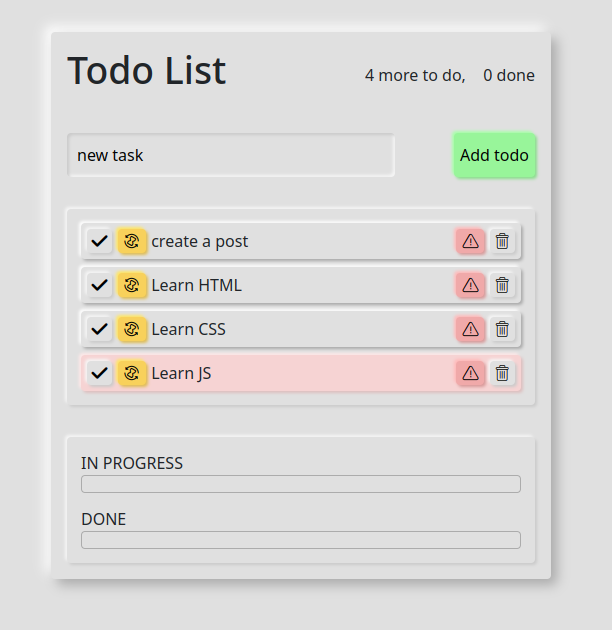

### simple_todo

---

## Задача:

- Простой "todo list" с интерфейсом.
- Можно добавлять или удалять задачи. Можно отмечать важные, пройденный или тикущие задачи.
- Часть верстки генерируется js.
- Интерфейс по своему вкусу.

---

## Инструменты:

  

Интерфейс в стиле "неоморфизм", для этого использовал сервис <a href="https://neumorphism.io/">neumorphism.io</a>.

---

Итоговый результат можно увидеть по данной <a href="https://brahner.github.io/simple_todo/">ссылке</a>